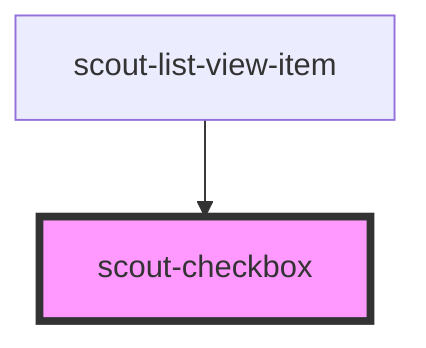

# scout-checkbox

<!-- Auto Generated Below -->

## Properties

| Property         | Attribute         | Description                                                                                                                                                                                       | Type                        | Default     |
| ---------------- | ----------------- | ------------------------------------------------------------------------------------------------------------------------------------------------------------------------------------------------- | --------------------------- | ----------- |
| `ariaLabelledby` | `aria-labelledby` | Use this prop if you need to connect your checkbox with another element describing its use, other than the property label.                                                                        | `string`                    | `undefined` |
| `checked`        | `checked`         |                                                                                                                                                                                                   | `boolean`                   | `false`     |
| `disabled`       | `disabled`        |                                                                                                                                                                                                   | `boolean`                   | `false`     |
| `label`          | `label`           |                                                                                                                                                                                                   | `string`                    | `undefined` |
| `name`           | `name`            |                                                                                                                                                                                                   | `string`                    | `undefined` |
| `validate`       | --                | Custom validation function run on top of the implicit validation performed by the browser. Return a string with the validation message to mark the input as invalid, or null to mark it as valid. | `(value: string) => string` | `undefined` |
| `value`          | `value`           |                                                                                                                                                                                                   | `string`                    | `undefined` |

## Events

| Event             | Description                                     | Type                                                            |
| ----------------- | ----------------------------------------------- | --------------------------------------------------------------- |
| `_scoutFieldId`   | Internal event used for form field association. | `CustomEvent<string>`                                           |
| `_scoutInvalid`   | Internal event used for form field validation.  | `CustomEvent<void>`                                             |
| `_scoutValidate`  | Internal event used for form field validation.  | `CustomEvent<{ element: HTMLElement; }>`                        |
| `scoutBlur`       |                                                 | `CustomEvent<void>`                                             |
| `scoutChecked`    |                                                 | `CustomEvent<{ checked: boolean; element: HTMLInputElement; }>` |
| `scoutInputChange` |                                                 | `CustomEvent<{ value: string; element: HTMLElement; }>`         |

## Dependencies

### Used by

 - [scout-list-view-item](../list-view-item)

### Graph

----------------------------------------------

*Built with [StencilJS](https://stenciljs.com/)*
