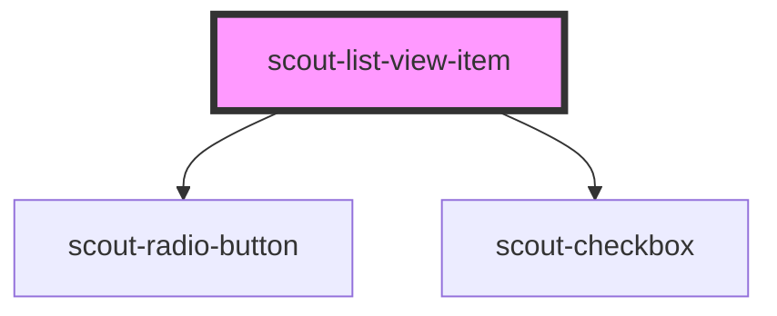

# scout-list-view-item

<!-- Auto Generated Below -->

## Properties

| Property    | Attribute   | Description                                                                                                                                                                                                     | Type                                          | Default     |
| ----------- | ----------- | --------------------------------------------------------------------------------------------------------------------------------------------------------------------------------------------------------------- | --------------------------------------------- | ----------- |
| `action`    | `action`    | The action to display on the right side of the item. For example, a chevron. This is purely visual and does not affect the behavior of the item in any way. Not visible when the type is "radio" or "checkbox". | `"chevron"`                                   | `null`      |
| `checked`   | `checked`   |                                                                                                                                                                                                                 | `boolean`                                     | `undefined` |
| `disabled`  | `disabled`  |                                                                                                                                                                                                                 | `boolean`                                     | `undefined` |
| `href`      | `href`      |                                                                                                                                                                                                                 | `string`                                      | `undefined` |
| `icon`      | `icon`      |                                                                                                                                                                                                                 | `string`                                      | `undefined` |
| `name`      | `name`      |                                                                                                                                                                                                                 | `string`                                      | `undefined` |
| `primary`   | `primary`   |                                                                                                                                                                                                                 | `string`                                      | `undefined` |
| `rel`       | `rel`       |                                                                                                                                                                                                                 | `string`                                      | `undefined` |
| `secondary` | `secondary` |                                                                                                                                                                                                                 | `string`                                      | `undefined` |
| `target`    | `target`    |                                                                                                                                                                                                                 | `string`                                      | `undefined` |
| `type`      | `type`      |                                                                                                                                                                                                                 | `"button" \| "checkbox" \| "link" \| "radio"` | `"button"`  |
| `value`     | `value`     |                                                                                                                                                                                                                 | `string`                                      | `undefined` |

## Events

| Event        | Description | Type                |
| ------------ | ----------- | ------------------- |
| `scoutClick` |             | `CustomEvent<void>` |

## Dependencies

### Depends on

- [scout-radio-button](../radio-button)
- [scout-checkbox](../checkbox)

### Graph

----------------------------------------------

*Built with [StencilJS](https://stenciljs.com/)*
