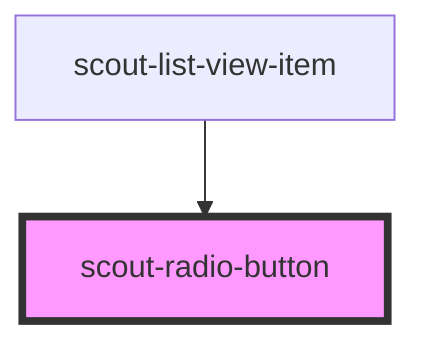

# scout-radio-button

<!-- Auto Generated Below -->

## Overview

The radio button component is used to let users select one option from a set.
When used in a form, make sure to wrap it in a Field component to display a
label, help text, and error messages.

## Properties

| Property         | Attribute         | Description                                                                                                                                                                                  | Type      | Default     |
| ---------------- | ----------------- | -------------------------------------------------------------------------------------------------------------------------------------------------------------------------------------------- | --------- | ----------- |
| `ariaLabelledby` | `aria-labelledby` | Use this prop if you need to connect your radio button with another element describing its use, other than the property label.                                                               | `string`  | `undefined` |
| `checked`        | `checked`         |                                                                                                                                                                                              | `boolean` | `false`     |
| `disabled`       | `disabled`        |                                                                                                                                                                                              | `boolean` | `false`     |
| `label`          | `label`           |                                                                                                                                                                                              | `string`  | `undefined` |
| `name`           | `name`            |                                                                                                                                                                                              | `string`  | `undefined` |
| `validity`       | `validity`        | Custom validation message. If set, the input is considered invalid by the browser, and if wrapped by a field component, the message is displayed. If not set, the input is considered valid. | `string`  | `undefined` |
| `value`          | `value`           |                                                                                                                                                                                              | `string`  | `undefined` |

## Events

| Event                   | Description                                                                                                                                                                     | Type                                                            |
| ----------------------- | ------------------------------------------------------------------------------------------------------------------------------------------------------------------------------- | --------------------------------------------------------------- |
| `_scoutFieldId`         | Internal event used for form field association.                                                                                                                                 | `CustomEvent<string>`                                           |
| `_scoutInvalid`         | Internal event used for form field validation.                                                                                                                                  | `CustomEvent<void>`                                             |
| `_scoutValidityChanged` | Internal event used for form field validation.                                                                                                                                  | `CustomEvent<{ element: HTMLElement; }>`                        |
| `scoutBlur`             |                                                                                                                                                                                 | `CustomEvent<void>`                                             |
| `scoutChecked`          |                                                                                                                                                                                 | `CustomEvent<{ checked: boolean; element: HTMLInputElement; }>` |
| `scoutInputChange`      | Event emitted when the input value changes. If you want to do custom validation, use the `scoutValidate` event instead to ensure forms are blocked by the browser when invalid. | `CustomEvent<{ value: string; element: HTMLElement; }>`         |
| `scoutValidate`         | Event emitted when the input needs to be validated. This is where you implement your custom validation. Set any possible validation message using the `validity` prop.          | `CustomEvent<{ value: string; element: HTMLElement; }>`         |

## Dependencies

### Used by

 - [scout-list-view-item](../list-view-item)

### Graph

----------------------------------------------

*Built with [StencilJS](https://stenciljs.com/)*
